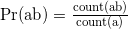
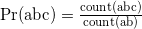

<h1 align="center"> Programming Competition </h1>
<h3 align="center"> Competitors' Package </h1>

<h3 align="center">University of Toronto Engineering Kompetition</h2>
<div align="center">
Jan 13, 2018 - Jan 14, 2018
<br>
Director: Christopher Chu
</div>


## Sponsored by


## Introduction
Welcome to UTEK 2018's programming competition! We have intercepted a series of messages from the Waterloo Engineering Competition. We need to determine what they're planning and how to disrupt their evil schemes!

We've obtained a number of encrypted messages (ciphertext) and need to find the original messages.
Unfortunately, they use a different key for encrypting each message so we'll need to crack each separately.
In part one, you will implement some ciphers that they have been known to use.
In part two, you will implement a simple machine learning technique to score how closely a sentence resembles English text.
In part three, you will combine the first two parts to automatically decipher texts.
As a bonus, you can create visualizations of your algorithms working to showcase them.

## Getting Started
- Clone or download this repository, which contains sample test cases, their solutions, the grading script and a dummy solution
- If you have any questions, file an [issue](issues) (requires a Github account)

## Disclaimer
All the ciphers described in this document are insecure and should not be used in production.

## Rules
1. You may use any programming language(s) that can run on the ECF or Google Cloud Platform, although it is recommend to use a high-level language with good string-processing support, such as Python.
2. You may use standard libraries. You may only use general-purpose utility libraries (e.g. lodash, boost) only. You may not use natural language libraries (e.n nltk). External code is subject to the same restrictions as libraries, e.g. using external code to swap characters in a string is fine, but external code to complete a question is not.
3. Your team must not use external help, i.e. ask questions of people outside of your team except for UTEK staff. You can use help fora (e.g. StackOverflow), but may not ask questions.
4. List any external resources used. For libraries, please provide a link in a README file. For non-trivial snippets, provide a link beside the copied code.

## Submission
You **must** submit the following before the deadline to be considered:
- Source code + any required binaries OR install commands
- Script to run your code (i.e. modify `./run` to run all of your scripts)
- Slides or any other presentation materials
- Screenshot(s) of your visualization (if applicable)

Submissions are due at <time> sharp. Email a `.tar.gz` file with the name `utek-programming-team00.tar.gz` (with 00 replaced with your actual team number) to programming@utek.skule.ca, containing everything listed above. It is your responsibility to ensure that everything runs using the grading script provided. I will spend up to five minutes working on obvious configuration errors for each team, so you should include clear installation instructions if necessary.

You can zip folders with the following command:

`tar -czvf utek-programming-team<your team number>.tar.gz path/to/directory-or-file`

## Testing Specification
All testing will either be done on an ECF Linux computer or on [Google Cloud Platform](https://cloud.google.com/). If you are using the ECF, you should SSH directly into a physical machine (`p1.ecf.utoronto.ca -> p185.ecf.utoronto.ca`). If you are using GCP, you must remain within the free tier (`f1-micro` machines).

You must provide a script `run` in the top level directory. Assume that the test cases are in a folder called `input` and write to a folder called `output` (which you may assume exists). Your script has ten minutes to complete all of the test cases. There will be about twice as many test cases for the real set.

There will be a test file for each subsection of the question e.g. `1a.in`, `1b.in`, `2a.in`. Output should be written to files called `1a.out` etc. Each test case will be on a separate line, with each parameter separated by a pipe character (`|`). No input or output will contain the pipe character. Ignore any blank lines. Nothing else should be in the input or output files.

Input will always consist of ASCII-encoded uppercase text, whitespace and punctuation. Leave any non-alphabetic characters unchanged. Output should consist only of uppercase text, whitespace and punctuation.

## Challenge

### Part 1: Practice
In this part, you will implement some simple encryption and decryption methods, using the key to encrypt messages and decrypt ciphertext. In general, the functions should be inverses of each other, i.e. `decrypt(encrypt(string, key), key) == string` should always be true.


#### Part 1 Input/ Output Specification
```
Encrypt:
Input: ENCRYPT|<key>|<message>
Output: <ciphertext>

Decrypt:
Input: DECRYPT|<key>|<ciphertext>
Output: <message>
```

`<key>` will be in [0, 26) for parts A and B

#### 1A: Simple Step Encryption
Implement step encryption. To calculate one step of the algorithm, each letter is circularly shifted to the next position in the alphabet, e.g. A becomes B, B becomes C, Z becomes A. Repeat this k times. Write code to encrypt message text and decrypt ciphertext given a key.

Example of encryption:
```
Input: ENCRYPT|3|ALPHABETIZE!

    ALPHABETIZE!        <- shift one position in the alphabet for each step
k=1 BMQIBCFUJAF!        <- note: Z shifts to A
k=2 CNRJCDGVKBG!
k=3 DOSKDEHWLCH!

Output: DOSKDEHWLCH!
```

#### 1B: Block Step Encryption
The block step code is an improvement on the simple step algorithm. Instead of a single key, we have N keys: k1, ... kn. Apply step encryption k1 times to the first letter, k2 times to the second to the second, etc. Repeat the key as needed.

Write code to encrypt message text and decrypt ciphertext given the key.

Example of encryption:
```
Input: ENCRYPT|1 3 5|ALPHABETIZE! THIS!

Explanation
    13513513513  5135   <- Repeat the key as many times as necessary
                <- note: the key skips non-alphabetic text in message
    ALPHABETIZE! THIS!
    BOUIDGFWNAH! YILX!  <- first letter is shifted 1 time, the second 3 etc.

Output: BOUIDGFWNAH! YILX!
```

#### 1C: Permutation Encryption
Implement permutation encryption. Given a permutation of the alphabet, swap each letter in the message with its corresponding letter. Write code to encrypt message text and decrypt ciphertext given the key.

```
Input: ENCRYPT|QWERTYUIOPASDFGHJKLZXCVBNM|HELLO WORLD!

Explanation
Alphabet: ABCDEFGHIJKLMNOPQRSTUVWXYZ
Key:      QWERTYUIOPASDFGHJKLZXCVBNM
              ^  ^
H in the message becomes I, E becomes T, etc.

Output: ITSSG VGKSR!
```

### Part 2: Train
To automate deciphering messages, we will need to develop a way of determining which candidate translations "look" like English. We will build a simple model for this based on real data. This part is completely independent of Part 1.

For example, "qxvch ywvwxv" does not look like English because the most common character is "v", unlike in English, where the most common character is "e". Similarly, "hseee otiamn" does not look like English because "eee" and "mn" rarely appear in English.

Part 2 Input/ Output Specification
```
2A: Counting
Input: <dataset> | <string>
Output: <number of appearances>

2B: Modelling
Input: <string 1> | <string 2>
Output: <whichever sentence is "more probable">

```
`<string>` will contain only uppercase letters. For the counting task, `<string>` will be no more than seven characters long.

#### 2A: Counting
Using the dataset [here](ptb.train.txt) for training, count the number of times each sequence of n letters (called an n-gram) appears for n <= 7. Ignore any non-uppercase characters in the corpus. Note that 26^7 ~= 8 billion, but only a small fraction of these combinations occur. Write code to count how many times each n-gram appears in the text.

You will need to preprocess the dataset as follows:
- Remove all `<unk>` tokens. These represent uncommon words
- Remove all `N` tokens. These represent numbers
- Remove all non-alphabetic characterse
- Convert everything to uppercase

You should count everything once and store it in a data structure, because you will reuse these counts many times when you run parts 2B and onward.

```
Dataset: HELLO WORLD! WELCOME!
Input: EL

HELLO WORLD! WELCOME!    Note: counts how many time the bigram "EL" appears

Output: 2
```

#### 2B: Modelling
We can use these counts to model how likely a sentence is to be English.
Some simple models for what the next letter would be the following, where `count(s)` is the number of times `s` appears in the training dataset.

For example,

 or&nbsp;


However, these will behave poorly if the letter combination never appears. So we'll take the weighted average of a few of these models. For example,


Then, to get the score for a whole sentence, we'll sum the log probabilities for each string of size N.


Where S is the length of the sentence you're scoring and N is the maximum number of characters to consider at once (N=4 in the examples, N=7 in your implementation).
The greater the result, the more "English" the sentence is.
Assume that 0/0 = 0.
Write a function to score a string and use it to determine which of two strings looks more like English.

```
Input: BLAH BL A BLAH | THIS IS A TEST

The second input is more "English" than the first.

Output: 2

```

#### 2C: Improving (optional)
This part will not be scored, but you can add additional features to your model if they improve your results for part 3. This may include checking the first letter of words, looking words up in a dictionary, etc. This is not needed for most of the test cases in part 3, but may make your solution more robust.

### Part 3: Crack
Fortunately, these ciphers are breakable with some statistics and enough computation power. In theory, we just need to find the key that maximizes the score from Part 2. You can assume that `lambda = [1e-6,1e-5,1e-4,1e-3,1e-2,1e-1,0.888889]`.

#### Part 3 Input/ Output Specification
```
Input:
<ciphertext> [| <key length> for 3B only]

Output:
<key> | <message>           For 3A and 3D
<key1> <key2> ... | <message>     For 3B, output the key separated by spaces
```

#### 3A: Step Code
For the step code, this is simple, there are only 26 possible keys, so we can brute force it by trying each key and scoring the result. Write a function that gives the most likely message text and key given the ciphertext.

```
Input: CRACK    DOSKDEHWLCH
ALPHABETIZE with k=3 (this is the example for 1A)

Output: 3   ALPHABETIZE
```

#### 3B: Block Step Code
The others are less easy to crack. The block step code has `26^{key_length}` possible keys, so you cannot try every possible key for any reasonably long key. One possibility is a method that makes incremental changes to the key to maximize the probability of the translated message. Some techniques for this include genetic algorithms, hill climbing and simulated annealing.

Write a function that will return the message text and key given the ciphertext and the key length.

```
Input: 3 | BOUIDGFWNAH YILX!

Note: 3 is the key length

Output: 1 3 5 | ALPHABETIZE THIS!
```

#### 3C: Block Step Code (no block size)
Repeat the same process as 3B, this time without knowing the size of the block. Optionally, you can use the [index of coincidence](https://en.wikipedia.org/wiki/Index_of_coincidence) to estimate the block size.

#### 3D: Permutation Code
The permutation code is the most difficult to crack. It has 26! possible keys, too many to brute force easily.
One solution is similar to that for 3B: use a method that incrementally maximizes the score.
Alternatively, you can use a [frequency attack](https://en.wikipedia.org/wiki/Frequency_analysis), where you try to match the letter frequencies to English.
You can use also a combination of both.

Write a function that will return the ciphertext and key. It may not be possible to extract some letters from the key (e.g. if the ciphertext contains no Zs). If so, fill those letters in with `*` to indicate that they are unknown.

### Part 4: Visualization

As part of your presentation, create a visualization to show an interesting aspect of your model or solution.
Any code used to generate this should be part of your repository and submitted, but it doesn't need to be reproducible, e.g. you can use a program on your computer and format the results in slides.
Submit the final result of your visualization in an appropriate format (screenshots, video, slides etc.).

Some ideas:
- Show what improving the log probability (score from part 2) actually means
- Visualize how your optimization method works
- If you used a randomized method for part 3, explain the tradeoff between more initialization points and longer improvements
- Given a sentence, show which parts are the most unusual in English: (see: http://karpathy.github.io/2015/05/21/rnn-effectiveness/, search for "Visualizing the predictions")


### Part 5: Generative Model
The model you trained in part 2 can be used to generate text. Given a series of characters, calculate the log-probability of the series concatenated with each letter. Then choose the next letter according to these probabilities. Repeat this for 1000 steps.

This task will be scored by inspection since there is a random component. If the text you generate seems reasonably like English, you will do well. If your model includes any additional features e.g. taking punctuation or spaces into account, feel free to include them.

```
Example:
Input: THE QUI

# score each possible next letter
THE QUIA <- score = -31.123
THE QUIB <- score = -51.521
THE QUIC <- score = -11.692
...

# randomly select the next letter according to the probabilities
# note that score is log(probability), so you need to exponentiate it
Choose A with probability exp(-31.123) / [exp(-31.123) + exp(-51.521) + … ]
Choose B with probability exp(-51.521) / [exp(-31.123) + exp(-51.521) + … ]
...

# repeat

Output (example): THEQUICLEVEOAREFESSTHFULBUSAUXEL
```

## Presentation

As part of your submission, you must submit a slideshow to be delivered to a panel of judges.
The six teams with the highest scores will receive an email inviting them back to present on Sunday.
Your presentation will be up to eight minutes with five minutes for questions.

I recommend that you focus on things that will be unique to your solution:
- Optimization tricks to run quickly
- Any additional features you added in Part 2C
- How you incrementally improve your key in Part 3
- Any visualizations you've created

## Scoring
### Test Cases
| Part            | Sub Part                           | Max Score  |
|-----------------|------------------------------------|------------|
| 1: Practice     | a: Step                            | 5          |
|                 | b: Block step                      | 5          |
|                 | c: Permutation                     | 5          |
| 2: Model        | a: Count                           | 5          |
|                 | b: Model                           | 10         |
| 3: Crack        | a: Step                            | 5          |
|                 | b: Block step                      | 10         |
|                 | c: Block step                      | 10         |
|                 | d: Permutation                     | 10         |
| 4: Visualize    | Shows interesting data             | 20         |
|                 | Well communicated                  | 10         |
| 5: Generate     |                                    | 10         |
| 6: Presentation | Design is well justified           | 25         |
|                 | Presentation quality               | 15         |
|                 | Presentation visuals               | 10         |

### Presentation

| Criterion | | | |
| ----------|-|-|-|
| Design Justification /25 | Explanations are detailed, all with solid reasoning | Explanations are detailed, reasoning is generally solid | Explanations and/or rationales are missing |
| Presentation Quality /15 | Presentation flows well and is easily followed | Presentation flows well | Presentation is disjointed and/or disorganized |
| Presentation Visuals /10 | Visuals add to the presentation | Visuals are used | Visuals detract from the presentation/ no visuals |

## Some Recommendations
- Parts 1 and 2 can be done in parallel.
- The speed of your implementation in part 2 will affect the number of possibilities you can try for part 3, so make sure your implementation for part 2 is reasonably fast.
- 1A is a special case of 1B or 1C, you can implement the latter using the former.


Good luck!